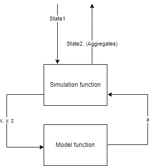

# Metsi forestry utilities

Metsi forestry utilities is a library forest related growth and forestry operations functions. It is primarily used as
a computation library for the Metsi forest development simulator.

## Technology and the project

This is primarily a Python library developed under Python 3.10. There are also R and lua based variants for some models,
usable via Python bindings. We offer support for this library via GitHub issues and welcome pull requests for
improvement.

This project uses the pyproject.toml for configuration and build. For setting up development environment, run
`pip install .[tests]`. Development can be readily done utilizing the unit test suites in `tests`. The project is
deployed under the namespace `lukefi.metsi.forestry`. Related Lua and R scripts and data files are packaged within the
namespace directories.

For using the Lua variant of the cross-cutting function, the FHK library is needed. Unfortunately this needs to be done
manually for the time being. The FHK library is published as a multiwheel directory in
https://github.com/menu-hanke/fhk/releases/expanded_assets/v4.0.0 but the pyproject.toml configuration does not allow
for this format to be included as a dependency. For the time being, manual run of `pip install -r requirements.txt` is
necessary to introduce this dependency to local environment.

For using the R based volume estimation function `lmfor_volume`, the `rpy2` library is needed. Manual run
of `pip install .[rpy]` is necessary.

We expect

* semantic commits constraining changes into categories in the spirit of
  https://sparkbox.com/foundry/semantic_commit_messages
* all functionality to be sufficiently unit tested to prove operation and address regressions

## Library structure

The structure of the library is as follows:

| package              | description                                                                                        | notes                                              |
|----------------------|----------------------------------------------------------------------------------------------------|----------------------------------------------------|
| l.m.f.cross_cutting  | Functionality for timber volume estimation with Annika Kangas' cross-cutting implementation        | Available as Python, R and Lua implementations     |
| l.m.f.harvest        | Thinning algorithms                                                                                | Currently an iterative basal area limited thinning |
| l.m.f.naturalprocess | Growth models and other natural processes                                                          ||
| l.m.f.preprocessing  | Utilities and functions for augmenting missing data or data generating in Metsi data model classes ||
| l.m.f.lua/r          | R and Lua scripts for alternative implementations                                                  ||

## Simulation and model functions

In order to perform a change in state. A state manipulation call is performed. The single call comprises of what is
called a simulation and model functions.

From the image under one may understand the main differences in responsibilities, inputs and outputs of these two
functions.

The simulation function manipulates the actual data model holding the state. This is typically a model entity like
ForestStand from the Metsi data model library. The model function is a computation function operating on primitive
values which the simulation function than uses to define a new state and/or generating the aggregate structure.

Something to keep in mind is that:

1) Simulation function has to always return a state, manipulated or not.
2) Collecting aggregates between changes in old and new state is optional.

## Forestry functions

### Cross cutting

The entry point for cross-cutting a tree is the `cross_cut` function in `cross_cutting/cross_cutting.py`. It implements
the Annika Kangas' cross-cutting algorithm originally written in R. The original R scripts are stored
in `tests/resources/cross_cutting`, and the test
at `tests\cross_cutting_test.py::CrossCuttingTest::test_py_implementation_equals_r_implementation` uses these scripts to
ensure that the python implementation follows the original R implementation.

However, the implementation depends on the `breast_height_diameter` argument being a positive real number. Therefore,
the `cross_cut` function treats trees whose `breast_height_diameter` is `0` or `None` as energy wood (timber grade = 3),
and returns a hardcoded volume and value.

