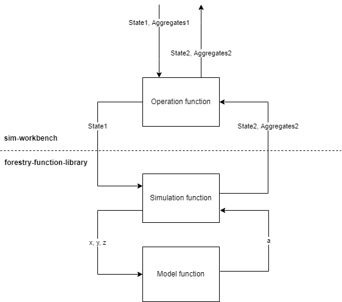

# Forestry function library for Mela2.0 simulation

Forestry function library (ffl) is a container for forestry functions used to manipulate states of forest-data-model.

Collecting aggregate data is optional data on the simulation function level.

The structure of the library is as follows:
```
forestryfunctions/
    harvest/
        thinning.py
    naturalprocess/
        grow_acta.py
    postprocessing/
        bucking.py
```

### Operation, simulation and function functions

In order to the simulator to perform a change in its state. Simulation makes a chained state manipulation call. The chain composes of three levels of functionality. The three main levels of logic are the operation, simulation and model function.

From the image under one may understand the responsibilityies, inputs and outputs of such levels.





From the simulators point of view, the operation level is the entry point of the call chain. It passes the state to the simulation function and recieves a new changed state and a optional collected aggregate structure of the new state.

The main responsibility of the operation function is to act as entypoint for changing the state, but also storing the aggregate it recieves or generates. The operation functions are implemented to the [sim-workbench](https://github.com/menu-hanke/sim-workbench) project.

The second and third level of the state manipulation chain are responsible of the actual state manipulation. The division between these goes as follows. The Simulation function is responsible of the actual manipualtion of the state as the model function is the one that knows how the old state changes into a new one. Model functions take in and give out primitive values which the simulation function than uses to define a new state and/or generating the aggregate structure.

In the image under one may see the inputs and outputs of each level taking responsibility in manipualting the state.
